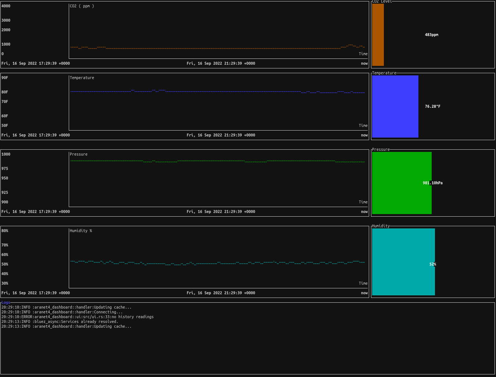
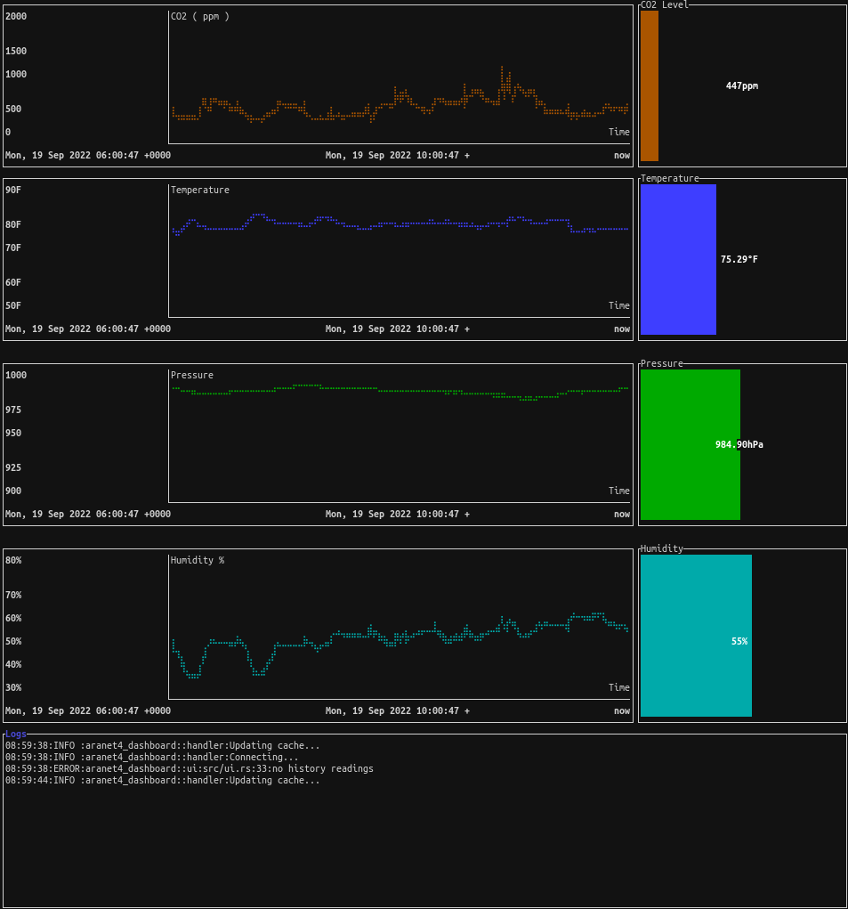

# aranet4-dashboard

**Work In Progress**

TUI Dashboard to display metrics from the Aranet4 CO2 Sensor. Uses [aranet4-rs](https://github.com/lpraneis/aranet4-rs) library to interface with the sensor.

# Milestones
- [x] Implement basic TUI
- [x] Implement on-demand readings
- [ ] Add additional command-line options for device discovery
- [ ] Refactor display loop
- [x] Display historical data 

# Screenshot

